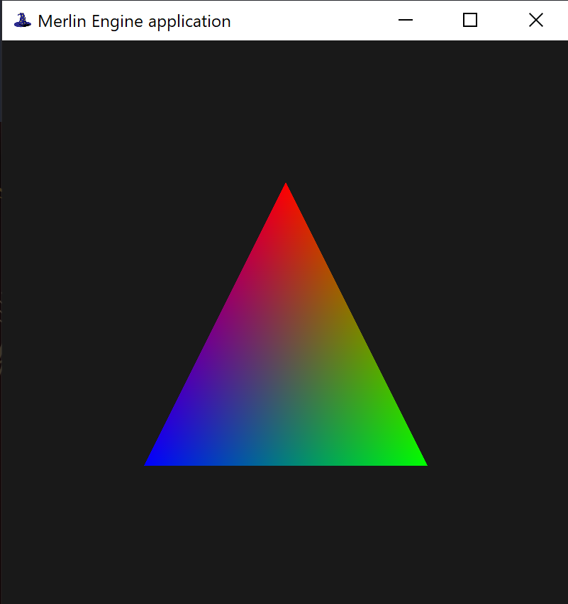

<div id="top"></div>

[![Contributors][contributors-shield]][contributors-url]
[![Forks][forks-shield]][forks-url]
[![Stargazers][stars-shield]][stars-url]
[![Issues][issues-shield]][issues-url]
[![MIT License][license-shield]][license-url]
[![LinkedIn][linkedin-shield]][linkedin-url]

<!-- PROJECT LOGO -->
<br />
<div align="center">
  <a href="https://github.com/othneildrew/Best-README-Template">
    
  </a>

  <h3 align="center">A Julia-based game engine API</h3>

  <p align="center">
    <a href=""><strong>Explore the docs »</strong></a>
    <br />
    <br />
    <a href="https://github.com/othneildrew/Best-README-Template">View Demo</a>
    ·
    <a href="https://github.com/alejandrodlsp/Merlin/issues">Report Bug</a>
    ·
    <a href="https://github.com/alejandrodlsp/Merlin/issues">Request Feature</a>
  </p>
</div>

<br/>
<!-- TABLE OF CONTENTS -->
  <summary>Table of Contents</summary>
  <ol>
    <li>
      <a href="#about-the-project">About The Project</a>
      <ul>
        <li><a href="#built-with">Built With</a></li>
      </ul>
    </li>
    <li>
      <a href="#getting-started">Getting Started</a>
      <ul>
        <li><a href="#prerequisites">Prerequisites</a></li>
        <li><a href="#installing">Installing</a></li>
      </ul>
    </li>
    <li><a href="#usage">Usage</a></li>
    <li><a href="#license">License</a></li>
    <li><a href="#contact">Contact</a></li>
  </ol>
<br/>
<!-- ABOUT THE PROJECT -->

## About The Project



Merlin is a game engine API based on the [Julia programming language](https://julialang.org). This engine is part of my final year project for Computer Games Development at University of Limerick, supervised by Dr. Patrick Healy

<p align="right">(<a href="#top">back to top</a>)</p>

### Built With

This project makes uses of some external mathematical and rendering libraries:

- [Julia programming language](https://julialang.org)
- [ModernGL.jl](https://github.com/JuliaGL/ModernGL.jl)
- [GLFW.jl](https://github.com/JuliaGL/GLFW.jl)
- [FileIO.jl](https://github.com/JuliaIO/FileIO.jl)

<p align="right">(<a href="#top">back to top</a>)</p>

<!-- GETTING STARTED -->

## Getting Started

### Prerequisites

This project is built upon the Julia language, so you will need to install the Julia interpreter to execute. You can download it [here](https://julialang.org/downloads/) or by running in linux:

```sh
wget https://julialang-s3.julialang.org/bin/linux/x64/1.6/julia-1.6.3-linux-x86_64.tar.gz
```

and

```sh
tar zxvf julia-1.6.3-linux-x86_64.tar.gz
```

<!-- INSTALLING -->

### Installing

To get all the project dependencies, you can use the built-in Julia package manager. You can activate the current environment by running the following command in package mode in the Julia interpreter:

```sh
pkg> activate .
```

and the you can install all dependencies using:

```sh
pkg> instantiate .
```

<!-- USAGE EXAMPLES -->

## Usage

To get started, you will need to create a Julia file and include the Application entry point

```julia
include('Core/Application.jl')
```

You can create an application and window context by creating an application object.

```julia
app = Application_Init(ApplicationParams())
```

Then start the application loop by running

```julia
Application_Run(app)
```

### Using application parameters

You can specify parameters for the application by passing an ApplicationParams object to the Application initialization function.

```julia
app = Application_Init(ApplicationParams(
  WindowSize = (100, 100),
  MaxWindowSize = (200, 200)
  MinWindowSize= (50, 50),
  Fullscreen = false,
  OnEvent = (e) -> (),
  OnUpdate = () -> (),
  OnRender = () -> (),
  Name = "Merlin Engine application"
))
```

### Handling events

```julia
 function onEvent(e)
   if(e.type == EventTypeMouseMoved)
    @printf "(%.2f , %.2f) \n" e.posx e.posy
   end
 end
```

### Pooling input

```julia
if Input_IsKeyPressed(KEY_SPACE)
  println("Jump!")
end
```

_For more examples, please refer to the [Documentation](https://example.com)_

<!-- LICENSE -->

## License

See `LICENSE.txt` for more information.

<!-- CONTACT -->

## Contact

Alejandro de los Santos - alejandrodlsp@hotmail.es

Project Link: [https://github.com/alejandrodlsp/merlin](https://github.com/alejandrodlsp/merlin)

<p align="right">(<a href="#top">back to top</a>)</p>

<!-- MARKDOWN LINKS & IMAGES -->
<!-- https://www.markdownguide.org/basic-syntax/#reference-style-links -->

[contributors-shield]: https://img.shields.io/github/contributors/alejandrodlsp/grogu-bot.svg?style=flat
[contributors-url]: https://github.com/alejandrodlsp/grogu-bot/graphs/contributors
[forks-shield]: https://img.shields.io/github/forks/alejandrodlsp/grogu-bot.svg?style=flat
[forks-url]: https://github.com/alejandrodlsp/grogu-bot/network/members
[stars-shield]: https://img.shields.io/github/stars/alejandrodlsp/grogu-bot.svg?style=flat
[stars-url]: https://github.com/alejandrodlsp/grogu-bot/stargazers
[issues-shield]: https://img.shields.io/github/issues/alejandrodlsp/grogu-bot.svg?style=flat
[issues-url]: https://github.com/alejandrodlsp/grogu-bot/issues
[license-shield]: https://img.shields.io/github/license/alejandrodlsp/grogu-bot.svg?style=flat
[license-url]: https://github.com/alejandrodlsp/grogu-bot/blob/master/LICENSE.txt
[linkedin-shield]: https://img.shields.io/badge/-LinkedIn-black.svg?style=flat&logo=linkedin&colorB=555
[linkedin-url]: https://www.linkedin.com/in/alejandro-de-los-santos-84152916b/
[product-screenshot]: images/Capture.png
