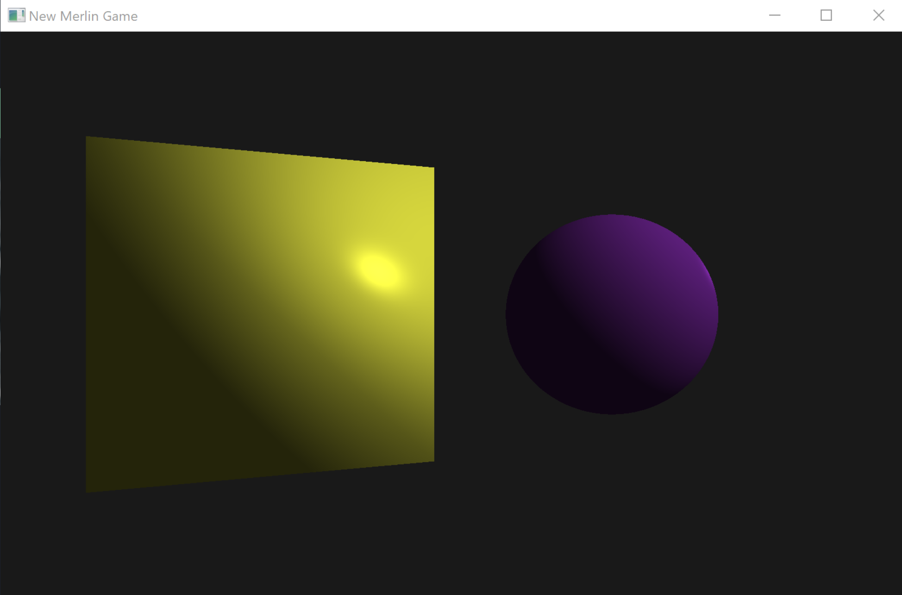

<div id="top"></div>

<!-- PROJECT LOGO -->
<br />
<div align="center">
  <a href="https://github.com/othneildrew/Best-README-Template">
    
  </a>

  <h3 align="center">A Julia-based game engine API</h3>
  <br/>
</div>

<br/>
<!-- TABLE OF CONTENTS -->
  <summary>Table of Contents</summary>
  <ol>
    <li>
      <a href="#about-the-project">About The Project</a>
      <ul>
        <li><a href="#built-with">Built With</a></li>
      </ul>
    </li>
    <li>
      <a href="#getting-started">Getting Started</a>
      <ul>
        <li><a href="#prerequisites">Prerequisites</a></li>
        <li><a href="#installing">Installing</a></li>
      </ul>
    </li>
    <li><a href="#usage">Usage</a></li>
    <li><a href="#license">License</a></li>
    <li><a href="#contact">Contact</a></li>
  </ol>
<br/>
<!-- ABOUT THE PROJECT -->

## About The Project



Merlin is a game engine API based on the [Julia programming language](https://julialang.org). This engine is part of my final year project for Computer Games Development at University of Limerick, supervised by Dr. Patrick Healy

<p align="right">(<a href="#top">back to top</a>)</p>

<hr>

### <b>Built With</b>

This project makes uses of some external mathematical and rendering libraries:

- [Julia programming language](https://julialang.org)
- [ModernGL.jl](https://github.com/JuliaGL/ModernGL.jl)
- [GLFW.jl](https://github.com/JuliaGL/GLFW.jl)
- [FileIO.jl](https://github.com/JuliaIO/FileIO.jl)
- [Csyntax.jl](https://github.com/Gnimuc/CSyntax.jl)
- [Meshes.jl](https://github.com/JuliaGeometry/Meshes.jl)

<p align="right">(<a href="#top">back to top</a>)</p>

<hr>

<!-- GETTING STARTED -->

## Getting Started

### Prerequisites

This project is built upon the Julia language, so you will need to install the Julia interpreter to execute. You can download it [here](https://julialang.org/downloads/) or by running in linux:

```sh
wget https://julialang-s3.julialang.org/bin/linux/x64/1.6/julia-1.6.3-linux-x86_64.tar.gz
```

and

```sh
tar zxvf julia-1.6.3-linux-x86_64.tar.gz
```

<!-- INSTALLING -->

### Installing

To get all the project dependencies, you can use the built-in Julia package manager. You can activate the current environment by running the following command in package mode in the Julia interpreter:

```sh
pkg> activate .
```

and the you can install all dependencies using:

```sh
pkg> instantiate .
```

<!-- USAGE EXAMPLES -->

## Usage

To get started, you will need to create a Julia file and include the Application entry point.

```julia
using Merlin
```

You can create an application and window context by creating an application object.

```julia
app = Application_Init(ApplicationParams())
```

Then start the application loop by running

```julia
Application_Run()
```

### <b>Creating window parameters </b>

You can create window parameters to pass in in the application initialization. All parameters are optional.

```julia
window_params = WindowParams(
  windowSize::Vector2{Int}
  maxWindowSize::Vector2{Int}
  minWindowSize::Vector2{Int}
  fullscreen::Bool
  name::String
)
```

### <b>Using application parameters </b>

You can specify parameters for the application by passing an ApplicationParams object to the Application initialization function.

```julia
app_parameters = ApplicationParams(
  window::WindowParams
  onStart::Function
  onShutdown::Function
  onEvent::Function
  onUpdate::Function
  onRender::Function
)
```

Then pass in the app parameters in the initialization method.

```julia
app = Application_Init(app_parameters)
```

### <b>Handling events</b>

You can register new event listeners by defining callback functions in application initialization. The onEvent callback will recieve an abstract event type.
Each event type has its own data associated, for example, EventTypeMouseMoved contains data about the new mouse cursor position.

```julia
 function onEvent(e)
   if(e.type == EventTypeMouseMoved)
    @printf "(%.2f , %.2f) \n" e.posx e.posy
   end
 end
```

### <b>Pooling input</b>

You can also dynamically check if an input is activated in a specific point in time.

```julia
if Input_IsKeyPressed(Merlin.KEY_SPACE)
  println("Jump!")
end
```

Options: <i>Input_IsKeyPressed, Input_IsMouseButtonPressed, Input_GetMousePos</i>

### <b>Creating a new scene</b>

You can programatically create a new scene and add entities manually.

```julia
camera = PerspectiveCamera()
scene = CreateScene("name", camera, Vector{GameEntity}())
```

Then in the onStart application callback you can load the newly created scene.

```julia
LoadScene(scene)
```

You can also load a scene from a scene definition file.

```julia
scene = LoadScene("path_to_scene.json")
```

### <b>Creating game entities</b>

Firstly, game entities need renderable components, we can create a primitive sphere:

```julia
program = ProgramResource_Load("path_to_program.glsl").program
sphere_renderable = Sphere(
                      1.5,
                      program,
                      Vector3{Float64}(0.0,0.2,0.5)
                      ) # Radius, program, color::optional
```

Then we can create a new game entity

```julia
entity = GameEntity(sphere_renderable) # Renderable, transform::Optional, componentList::Optional
```

Then we can instantiate the entity in the scene

```julia
Instantiate(scene, entity)
```

<hr>

<!-- CONTACT -->

## Contact

Alejandro de los Santos - alejandrodlsp@hotmail.es
<br>
Student ID: 18218822

<p align="right">(<a href="#top">back to top</a>)</p>

<!-- MARKDOWN LINKS & IMAGES -->
<!-- https://www.markdownguide.org/basic-syntax/#reference-style-links -->

[product-screenshot]: images/Capture.png
